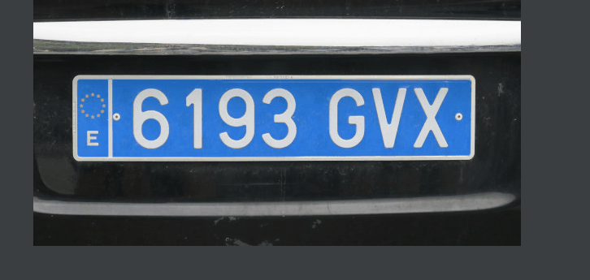

# DarkShield Files API: Search/Masking of a Spanish license plate image

This example demonstrates the use of the *darkshield-files* API to search and 
mask an image of a Spanish license plate. To run, the *plankton* web services API must be 
hosted on the location specified in server_config.py (by default *http://localhost:8959*) and must have the *darkshield* and 
*darkshield-files* plugins installed.

Spanish License plate number is searched for using a regular expression pattern and masked with black box redaction.

To execute, run *python main.py*.

The results will be placed inside of the *license-plate-masked* directory.
