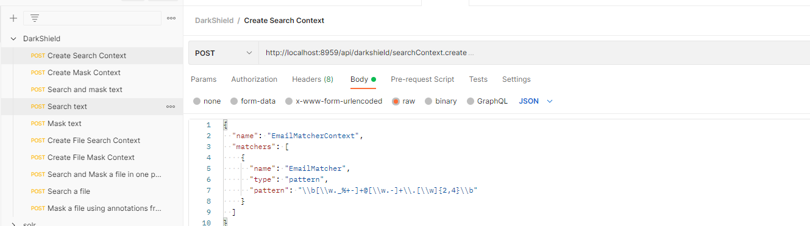
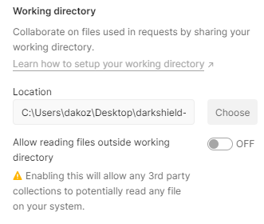

# Sample Postman Collection for interacting with the DarkShield API

A collection of Postman requests to interact with the *DarkShield* and *DarkShield-Files* APIs.
The *DarkShield.postman_collection.json* file can be imported into the Postman application to
try out some requests. The working directory setting for Postman should be set to this folder
in order to successfully use any of the requests that utilize files.

This collection assumes that the DarkShield API is hosted at localhost:8959.
