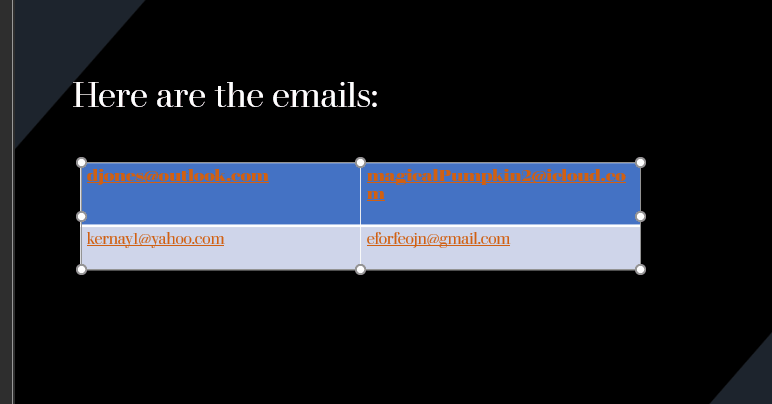

# DarkShield Files API: Microsoft PowerPoint Document Search/Masking

This example demonstrates the use of the *darkshield-files* API to search and
mask PowerPoint (*.ppt* and *.pptx*) documents. To run
the demo, the *plankton* web services API must be hosted on the location specified in server_config.py (by default *http://localhost:8959*)
and must have the *darkshield* and *darkshield-files* plugins installed.
This example requires version 1.4.1 or higher of *plankton*.

The example will find and mask the following:

1. Names (NameMatcher): Found using Named Entity Recognition (NER) and masked using
format-preserving encryption.
2. Emails (EmailMatcher): Found using a regular expression and masked using a hashing
function.
3. Credit Card Matcher(CcnMatcher): Found using a regular expression and masked using
format-preserving encryption.
4. Social Security Numbers (SsnMatcher): Found using a regular expression pattern and
masked by redacting the first 5 digits.

To execute, run *python main.py*.

The results will be placed in the *personal-info-masked* directory.
